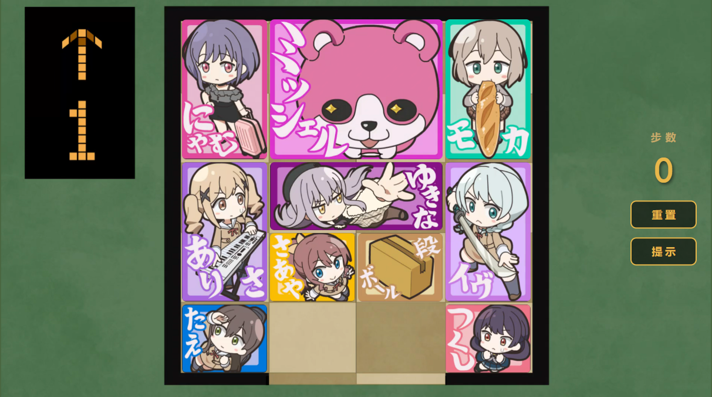

# 🎀 BanG Dream! 华容道

一个以 **BanG Dream!** 为主题的网页华容道（Klotski）益智小游戏。帮助米歇尔（Michelle）从重重包围中逃出，到达底部出口即为通关！

## 🎮 游戏特性

- **经典华容道玩法** — 4×5 棋盘，10 个角色方块，拖拽移动
- **智能提示** — 内置 BFS 最短路径求解器，点击"提示"自动执行最优下一步
- **纯前端单文件** — 零依赖，[**点击**](https://fflow2023.github.io/BanGKlotski) 即可游玩
- **移动端适配** — 支持触摸拖拽操作

## 💡 灵感来源

本项目灵感来源于动画 [《BanG Dream!》元祖第 19 集](https://www.bilibili.com/bangumi/play/ep3129294)，剧中出现了华容道的小游戏，于是萌生了复刻这个小游戏的想法。    

## 🤖 关于开发

主要代码内容由 Claude Opus 4.6 完成。  
后续优化由 GPT-6.1 Sol 完成。

## ⚖️ 版权声明

- 游戏中使用的角色设定、图像、音频及相关素材版权归 **BUSHIROAD** 旗下 **BanG Dream! 企划** 所有。
- 本项目为非盈利粉丝向同人作品，仅供邦邦粉丝之间学习交流使用。如有侵权请联系删除。
